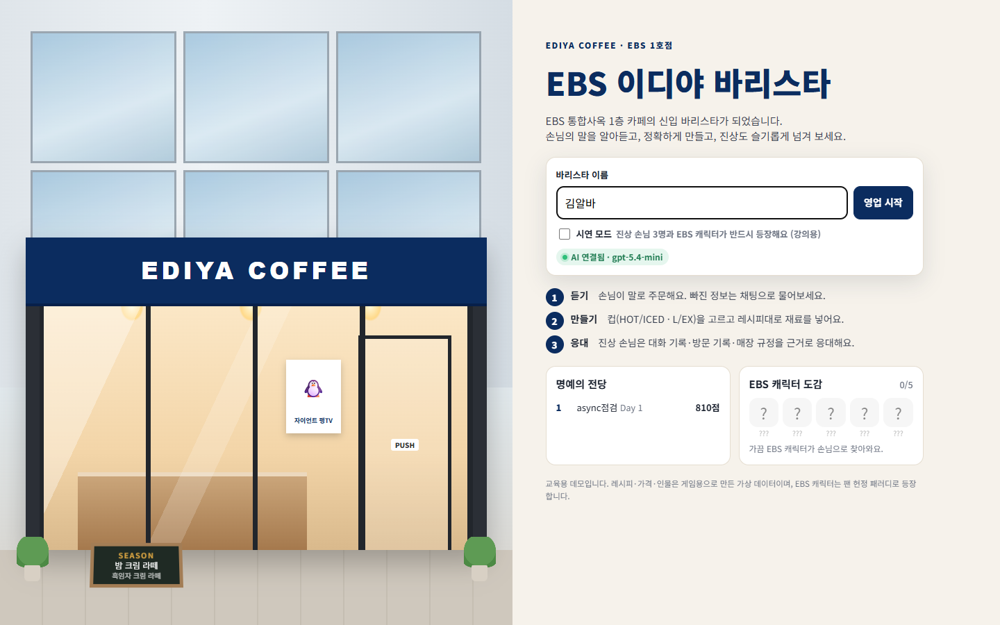
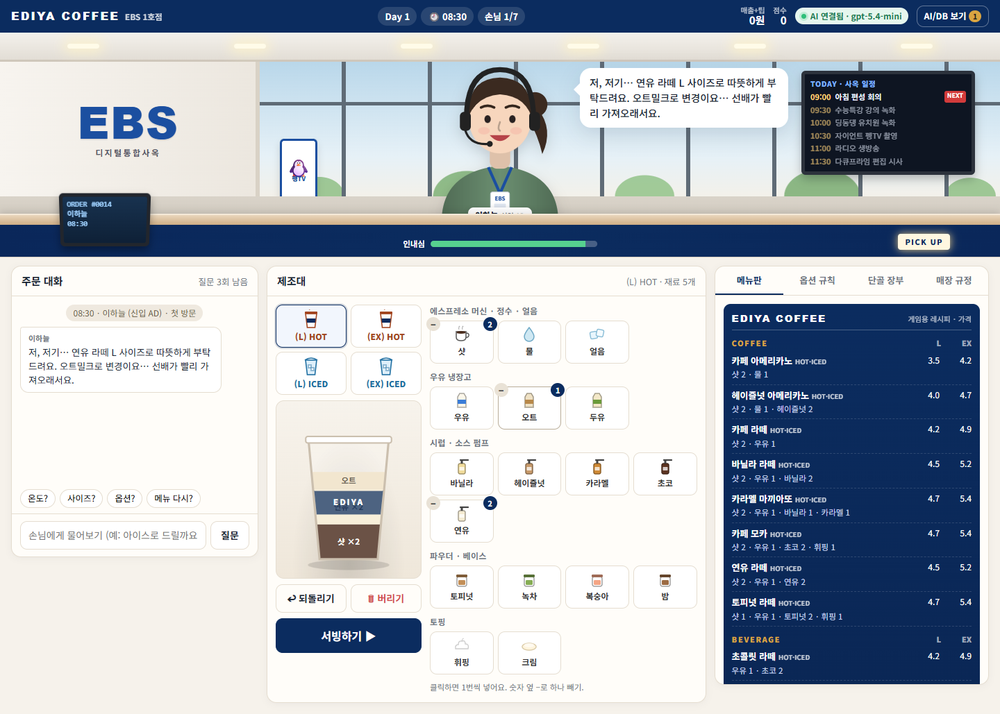
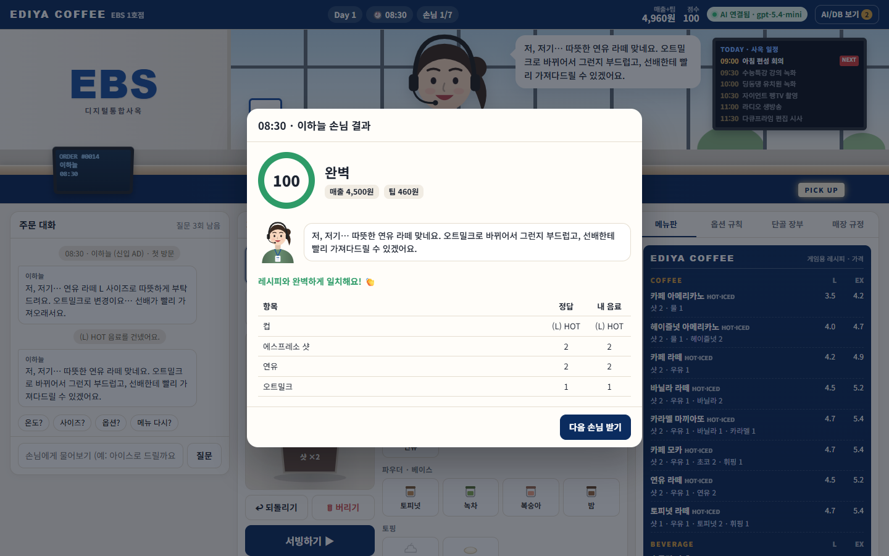
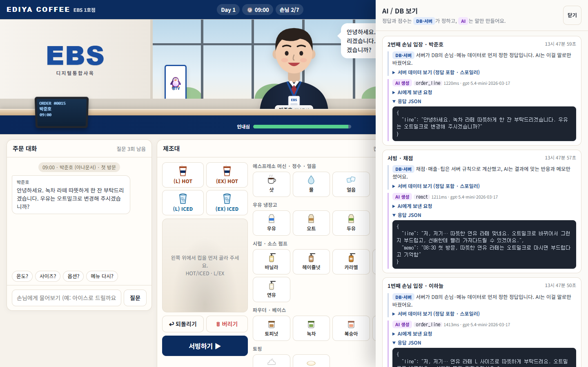

# ☕ EBS 이디야 바리스타


EBS 통합사옥 1층 이디야커피(EBS 1호점) 바리스타가 되어, 말로 주문하는 손님(가끔은 진상, 가끔은 EBS 캐릭터)을 응대하고 음료를 만드는 **교육용 데모 게임**입니다.
기획서는 [PRD.md](PRD.md)에 있습니다.

### 🎮 [바로 플레이하기 → ebs-ediya-barista.vercel.app](https://ebs-ediya-barista.vercel.app)

> 핵심 원칙: **정답은 DB가 정하고, 말은 AI가 한다.**
> 레시피·주문 정답·채점·진상 응대 등급은 서버 로직과 DB가 정하고, 생성형 AI는 손님 대사와 응대 답변의 사실 추출만 맡습니다.

## 스크린샷

| 시작 화면 | 주문 듣고 음료 만들기 |
|---|---|
|  |  |
| **채점 결과** | **AI/DB 보기** |
|  |  |

- **시작 화면**: 바리스타 이름을 넣고 영업을 시작합니다. 강의 때는 시연 모드를 켜세요.
- **주문·제조**: 손님이 말로 주문하면 컵(HOT/ICED · L/EX)을 고르고 재료를 넣습니다. 오른쪽에 메뉴판과 옵션 규칙이 있습니다.
- **채점 결과**: 서버가 정답 레시피와 내 음료를 항목별로 비교하고, AI 손님이 결과에 맞게 반응합니다.
- **AI/DB 보기**: 서버가 먼저 정한 정답(DB)과 AI에게 보낸 요청, AI 응답 JSON을 나란히 보여줍니다.

## 로컬 실행

Node.js 22.5 이상이 필요합니다 (내장 `node:sqlite` 사용). 로컬에서는 `data/cafe.db` SQLite 파일에 기록을 저장합니다.

```bash
npm install
npm start          # http://localhost:3000
```

### AI 연결 (선택)

`.env.example`을 `.env`로 복사하고 키를 넣으면 손님 대사를 OpenAI 모델이 생성합니다.

```
OPENAI_API_KEY=sk-...
```

키가 없거나 호출이 실패하면 **오프라인 모드**(미리 준비한 템플릿 대사)로 자동 전환되어 게임은 끊기지 않습니다. 화면 오른쪽 위 배지로 상태를 확인할 수 있습니다.

| 환경 변수 | 기본값 | 설명 |
|---|---|---|
| `OPENAI_API_KEY` | 없음 | 없으면 오프라인 모드 |
| `OPENAI_MODEL` | `gpt-5.4-mini` | 사용할 모델 |
| `AI_TIMEOUT_MS` | `12000` | 이 시간이 지나면 템플릿 대사로 대체 |
| `PORT` | `3000` | 서버 포트 |
| `DATABASE_URL` | 없음 | 있으면 SQLite 대신 Neon Postgres 사용 (배포용) |

> `.env`, `.env.local`은 `.gitignore`에 들어 있어 저장소에 올라가지 않습니다. API 키는 절대 커밋하지 마세요.

## Vercel 배포

Vercel에서는 파일에 쓸 수 없어 SQLite 대신 **Neon Postgres**를 씁니다. `server.js`가 Express 앱을 `export default`하므로 별도 설정 없이 배포됩니다.

1. Vercel 프로젝트에 Neon을 연결합니다. `DATABASE_URL`이 자동으로 등록됩니다.
   ```bash
   vercel integration add neon
   ```
2. OpenAI 키를 **환경변수**로 등록합니다. 코드나 파일에 넣지 않습니다.
   ```bash
   vercel env add OPENAI_API_KEY production --sensitive
   ```
3. 배포합니다.
   ```bash
   vercel deploy --prod
   ```

테이블과 기본 데이터(메뉴·손님·규정)는 첫 요청 때 자동으로 만들어집니다.

## 강의에서 쓰기 좋은 기능

- **시연 모드** (시작 화면 체크박스): 하루에 진상 손님 3명과 EBS 캐릭터 1명이 반드시 등장합니다. Day 1은 말 바꾸기·우기기·가짜 단골, Day 2는 재촉·환불·무리한 요구 순서입니다.
- **AI/DB 보기** (게임 화면 오른쪽 위): 손님마다 서버가 정한 정답(DB), AI에게 보낸 요청, AI 응답 JSON을 나란히 보여줍니다.

## 게임 구성

| 요소 | 담당 | 내용 |
|---|---|---|
| 주문 정답 | DB·서버 | 손님 취향·메뉴 데이터로 메뉴/온도/사이즈/옵션 결정 |
| 주문 대사 | AI | 명확 · 생략(온도/사이즈) · 묘사형 · "지난번 그거" 네 방식 |
| 되묻기 | AI | 정답 데이터대로만 답함, 질문할수록 인내심 감소 |
| 채점 | 서버 | 온도 -25, 사이즈 -10, 재료 1개 차이당 -12, 버린 음료 -5 |
| 반응·메모 | AI | 틀린 부분을 짚는 반응, 다음 방문 때 기억할 메모 갱신 |
| 진상 응대 | AI 추출 → 서버 판정 | 답변에서 정중함·사과·근거·약속 조치를 뽑고 매장 규정과 대조해 S~C 등급 |
| 단골 기억 | DB | 방문 횟수, 스탬프, 지난 주문, 메모. 3번 연속 망치면 진상으로 돌아옴 |
| 이스터에그 | DB | 펭수·뚝딱이·번개맨·뿡뿡이·짜잔형이 가끔 방문, 도감에 기록 |
| 마감 리포트 | AI | 점장님 피드백과 손님 리뷰 (통계·별점은 서버 계산) |

### 진상 손님 6유형
말 바꾸기 · 우기기 · 가짜 단골 · 규정 밖 요구 · 재촉·반말 · 다 마시고 환불

응대 창에서 **대화 기록 / 주문·방문 기록 / 매장 규정**을 열어 근거를 확인하고 응대하면 가산점이 있습니다.

## 폴더 구조

```
server.js          Express API
src/content.js     메뉴·재료·규정·손님·일정 원본 데이터 (부팅 시 DB에 시드)
src/db.js          DB 스키마와 조회 함수 (로컬 SQLite data/cafe.db / 배포 Neon Postgres)
src/game.js        주문 생성, 레시피 계산, 채점, 진상 판정 (결정적 로직)
src/ai.js          OpenAI 호출, 프롬프트, 오프라인 대체 대사
public/            화면 (HTML/CSS/바닐라 JS)
docs/intro.gif     README 상단 소개 영상 (video/ 에서 렌더링한 mp4를 GIF로 변환)
docs/screenshots/  README용 스크린샷
video/             소개 영상 (Remotion) · video/README.md 참고
```

로컬 기록을 초기화하려면 서버를 끄고 `data/cafe.db*` 파일을 지우세요.

## 참고

- 매장 위치: 경기 고양시 일산동구 한류월드로 281 EBS 통합사옥 1층 (EBS 1호점)
- 사이즈 L/EX, HOT/ICED 표기는 2025년 12월 이디야 사이즈 개편 이후 기준을 따랐습니다.
- 레시피·가격·인물은 게임용 가상 데이터입니다. 매장 그림은 실제 사진이 아닌 CSS 일러스트이며, EBS 캐릭터는 팬 헌정 패러디로 이모지로만 표현했습니다.
